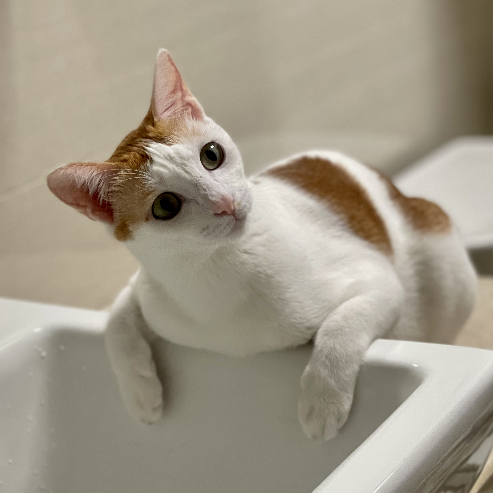

# This is Pei's awesome website


Here's some tect, I like the interent. I use [google](https://www.google.com/) all the time to do data science.

They are my baby cats Tomato and May, who would like to meet you all.



```{r}
library(tidyverse)

```


Here's a direct link to the about page: [about](about.html)


I also made a bonus [extra page](extra_page.html)

Here's a page with [plotly](plotly.html).